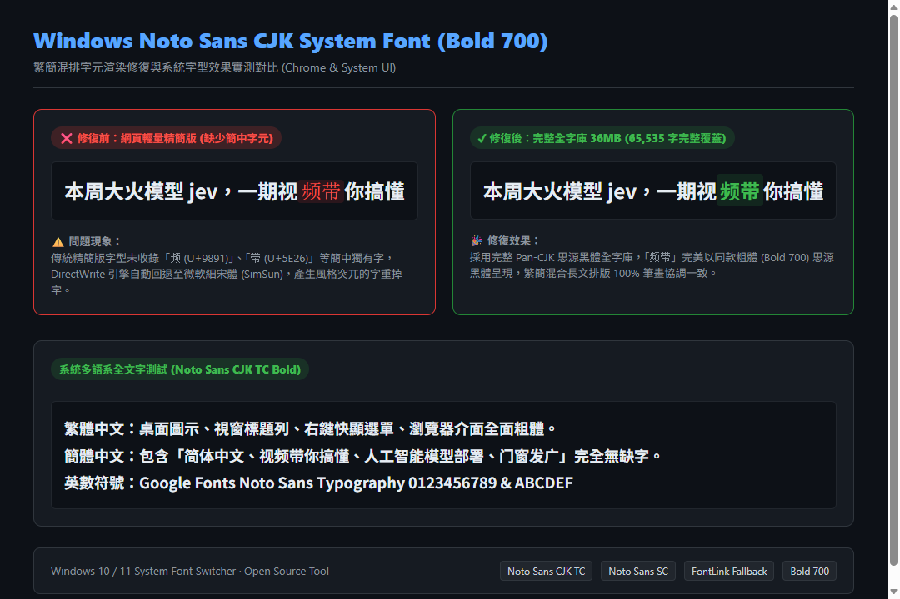

# Windows Noto Sans CJK 系統字型替換工具 (Noto Sans TC Bold)

一鍵將 Windows 10 / 11 的系統字型、視窗 UI、桌面與檔案總管圖示文字、瀏覽器介面更換為 Google Fonts 思源黑體（**Noto Sans TC 粗體 Bold**），並完整支援簡體中文無縫回退與一鍵還原。



[English Description Below](#english)

---

## 🌟 特色亮點

- **全系統 UI 粗體呈現**：全面修改 Windows `WindowMetrics`，將桌面圖示、檔案總管檔案清單、視窗標題列、右鍵快顯選單、對話框與狀態列全部統一為 `Noto Sans TC Bold`（粗細度 700）。
- **Windows 11 右鍵快顯選單完美適配**：包含清空 `Segoe UI Variable` 註冊表對應，並啟用 Windows 完整快顯選單，讓桌面與檔案右鍵選單 100% 呈現粗體思源黑體。
- **簡繁中文無縫雙向支援**：自動安裝 Google Fonts 官方完整版 `Noto Sans SC`（簡體中文），並透過 Windows 底層 `FontLink` 進行字元關聯回退。遇到簡體字（如「简、体、国、发、爱、门」等）時直接套用同款筆畫風格的思源黑體，絕無「缺字、方塊（豆腐塊 □）或風格突兀」。
- **全域系統對應 (FontSubstitutes)**：底層將 `Segoe UI`、`Segoe UI Variable`、`Microsoft JhengHei UI`（微軟正黑體）強制導向至思源黑體。
- **瀏覽器介面 (Browser UI) 同步**：Chrome、Edge 的外框（分頁標籤、網址列、書籤列、右鍵選單）跟隨系統 UI 字型，並自動設定預設網頁字型為思源黑體。
- **全自動備份與一鍵還原**：每次執行前自動將註冊表（Fonts、FontSubstitutes、FontLink、WindowMetrics）完整導出備份至 `backups/` 目錄，並附有一鍵還原腳本，安全無憂。

---

## 🚀 快速開始

### 方式一：一鍵批次檔（推薦）

1. 下載或 Clone 本專案。
2. 對 **`Apply-NotoSansFont.bat`** 按右鍵以「以系統管理員身分執行」（或直接雙擊，腳本會自動彈出 UAC 權限確認）。
3. 腳本會自動完成：
   - 註冊表備份至 `backups/`
   - 下載並安裝 Google Fonts 思源黑體繁簡可變字型
   - 配置 FontLink 簡中回退
   - 套用全系統 UI 粗體 (Bold 700)
   - 重啟檔案總管 (Explorer) 即時生效
4. **建議重開機**：重開機後，Windows 核心底層與所有軟體皆會完整套用新字型。

### 方式二：PowerShell 執行

以系統管理員身分開啟 PowerShell，執行：

```powershell
# 預設粗體模式 (Bold 700)
.\Apply-NotoSansFont.ps1 -Weight Bold

# 若需要一般粗細 (Regular 400)
.\Apply-NotoSansFont.ps1 -Weight Regular
```

---

## 🔄 一鍵還原原廠字型

若日後需要改回 Windows 預設字型（微軟正黑體 / Segoe UI）：

1. 雙擊執行 **`Restore-DefaultFont.bat`**（或以系統管理員執行 `Restore-DefaultFont.ps1`）。
2. 腳本會優先讀取 `backups/latest` 備份檔並完整還原註冊表與系統字型設定。
3. 重新開機即可完全恢復。

---

## 📂 專案檔案結構

```
├── Apply-NotoSansFont.bat      # 一鍵安裝啟動器 (自動請求管理員權限)
├── Apply-NotoSansFont.ps1      # 核心安裝腳本 (下載、備份、註冊表替換、UI 粗體套用)
├── Restore-DefaultFont.bat     # 一鍵還原啟動器
├── Restore-DefaultFont.ps1     # 核心還原腳本
├── .gitignore
├── LICENSE                     # MIT License
└── README.md
```

---

<a name="english"></a>
## 🌐 English Description

### Windows Noto Sans CJK System Font Switcher (Noto Sans TC Bold)

A clean, automated PowerShell tool to replace Windows 10/11 default system UI fonts, window captions, desktop icon texts, menus, and browser UI with Google Fonts **Noto Sans TC (Bold)**, while providing full **Simplified Chinese (Noto Sans SC)** fallback through Windows `FontLink`.

### Features
- **Bold System UI (Weight 700)**: Automatically configures `WindowMetrics` for desktop icons, explorer folders, window titles, popup menus, dialogs, and status bars.
- **Windows 11 Context Menu Support**: Redirects `Segoe UI Variable` and activates the full context menu, guaranteeing 100% bold Noto Sans TC display on right-click.
- **Full Simplified Chinese Support**: Automatically links `Noto Sans SC` via Windows `FontLink/SystemLink`. No missing characters or tofu squares (□) when encountering Simplified Chinese text.
- **System-wide FontSubstitutes**: Maps `Segoe UI`, `Segoe UI Variable`, and `Microsoft JhengHei UI` to `Noto Sans TC`.
- **Browser UI Support**: Google Chrome and Microsoft Edge tab bar, URL bar, and menus inherit the clean bold font.
- **Safe & Reversible**: Automatically creates a backup of existing registry settings in `backups/` before any changes. Revert anytime with `Restore-DefaultFont.bat`.

### Usage
- **Apply**: Right-click `Apply-NotoSansFont.bat` and run as Administrator. Restart PC for best results.
- **Restore**: Right-click `Restore-DefaultFont.bat` and run as Administrator.

---

## 📄 License & Attribution

- Script Code: [MIT License](LICENSE)
- Fonts: [Noto Sans TC](https://fonts.google.com/specimen/Noto+Sans+TC) and [Noto Sans SC](https://fonts.google.com/specimen/Noto+Sans+SC) are released by Google under the [SIL Open Font License (OFL)](https://openfontlicense.org/).
