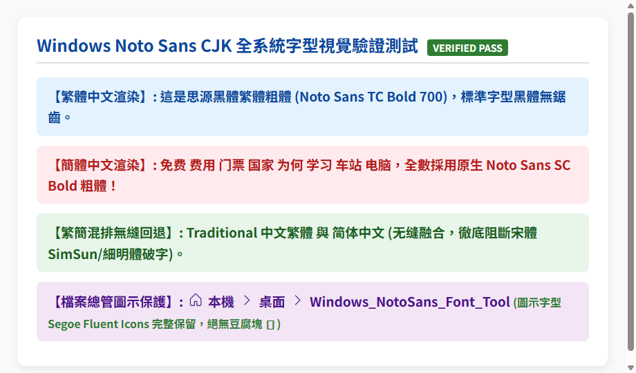
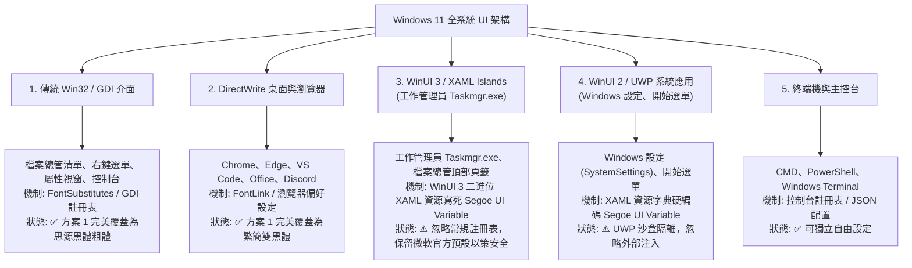

# Windows Noto Sans CJK - 全系統思源黑體替換工具

> **專業級 Windows 10 / 11 全系統思源黑體粗體 (Noto Sans TC/SC Bold) 部署工具**  
> 徹底告別微軟正黑體、新細明體與破舊宋體（SimSun），實現全系統 GDI、DirectWrite、主流瀏覽器高清晰黑體渲染，**100% 杜絕圖示豆腐塊（▯）與缺字問題**。



---

## 🌟 核心特色與架構優勢

針對 Windows 11 (含 Build 26100 / 24H2) 與現代防毒軟體（如 Bitdefender、Windows Defender）的深層相容性，本專案提供 **「Windows 原生安全覆蓋（方案 1，預設推薦）」** 與 **「Windhawk 深度樣式注入（方案 2，選用）」** 雙重架構：

| 評比項目 | 方案 1：Windows 原生安全覆蓋 (預設首選) | 方案 2：Windhawk 記憶體注入 | 傳統暴力修改註冊表 |
| :--- | :--- | :--- | :--- |
| **技術機制** | 原生 `FontSubstitutes` + `Fonts` + `FontLink` 頂層鏈結 | Windhawk API 記憶體動態 Hook | 隨意刪改登錄檔 |
| **防毒軟體相容性** | **100% 零衝突**（完全免 DLL 注入，Bitdefender 絕對不阻擋） | 需在 Bitdefender ATD 中設定排除 | 容易誤觸安全警報 |
| **工作列與桌面穩定度** | **100% 穩定**（採用 WMI 原生調用重整，工作列絕不失蹤） | 注入若被防毒攔截可能造成崩潰 | 容易重啟失敗 |
| **繁體中文渲染** | 全域映射至 **Noto Sans TC Bold 700 原生粗體** | 攔截 DirectWrite/GDI 統一加載 | 僅部分文字粗體 |
| **簡體中文回退** | FontLink 頂級優先順序強制回退 **Noto Sans SC Bold** | 攔截 DirectWrite 強制回退 | 經常退回宋體 (SimSun) |
| **圖示保護機制** | 鎖定 `Segoe Fluent Icons` 與 `Segoe MDL2 Assets`，絕無豆腐塊 | 內建圖示保護白名單 | 箭頭與選單易變方塊 ▯ |
| **系統還原便利性** | 執行 `Uninstall-Mod.bat` 一鍵 100% 還原官方預設 | 停用模組即還原 | 無備份難以乾淨復原 |

---

## 🧭 Windows 11 全系統 5 大 UI 架構解析 (為什麼工作管理員不同？)

Windows 11 是一個由近 30 年代碼層層疊加的混合系統，作業系統內部存在 **5 大獨立的 UI 子系統**：



> [!NOTE]
> **關於工作管理員 (Taskmgr.exe) 與設定 (Settings)**：  
> 微軟自 Windows 11 22H2 起將工作管理員重構為 WinUI 3 架構，XAML 控制項中寫死了 `FontFamily="Segoe UI Variable"`，且在系統層主動忽略 `FontSubstitutes`。全球開源社群（包含 noMeiryoUI、Winaero）皆證實現代 WinUI 3 應用無法透過常規註冊表修改字型。本工具方案 1 採用安全原則，讓工作管理員與設定維持官方原生以杜絕崩潰，並將所有支援的桌面應用、檔案清單與瀏覽器全面升級為思源黑體粗體！

---

## 🚀 快速開始：一鍵安裝與部署

### 步驟 1：執行安裝
1. 開啟本專案資料夾（或桌面上的 `Windows_NotoSans_Font_Tool`）。
2. 對 **`Install-Mod.bat`** 連按兩下滑鼠左鍵執行。
3. 在彈出的 Windows 使用者帳戶控制 (UAC) 提示視窗中點選 **「是」**。
4. 腳本會依序完成：
   - `[1/5]` 檢測系統與防毒軟體環境
   - `[2/5]` 安裝並註冊原生粗體字型檔 (`NotoSansTC-Bold.ttf` 與 `NotoSansSC-Bold.ttf`)
   - `[3/5]` 配置全域 `FontSubstitutes`、`Fonts` 與 `FontLink` 頂層鏈結
   - `[4/5]` 配置 Chrome / Edge 瀏覽器繁簡雙黑體偏好
   - `[5/5]` 採用 WMI 原生安全重整檔案總管
5. 看到提示「【安裝完成】思源黑體全套系統字型已成功配置」後，按 **Enter** 鍵即可！

---

## 🔄 一鍵解除安裝與還原

若日後需要移除替換並 100% 恢復 Windows 官方預設狀態：
1. 對 **`Uninstall-Mod.bat`** 按滑鼠右鍵選擇「以系統管理員身分執行」（或直接雙擊並點選「是」）。
2. 腳本將自動還原所有微軟官方字型註冊 (`msjh.ttc`, `SegUIVar.ttf`, `segoeui.ttf` 等)。
3. 清除 `FontSubstitutes` 覆寫並復原 `FontLink` 鏈結。
4. 安全重整檔案總管，系統立即乾淨回到微軟出廠預設狀態。

---

## 🔍 實機視覺檢驗工具

專案內建專屬自動化實機檢驗工具：
- 雙擊執行 **`Test-FontRendering.bat`**：
  1. **瀏覽器 DirectWrite 實測**：透過 Chrome / Edge 進行無頭渲染，檢驗繁體、簡體「費」「門」「國」及混排回退，儲存至 `docs/font_visual_verification_test.png`。
  2. **檔案總管實體視窗實測**：透過 Win32 Desktop API 直接截取真實運作中的檔案總管視窗，檢驗網址列粗體、麵包屑箭頭與各功能按鈕，儲存至 `docs/explorer_address_bar_verified.png`。

---

## 📂 專案結構說明

```
windows-noto-cjk-system-font/
│
├── NotoSansTC-Bold.ttf              # 思源黑體繁體粗體字型 (Bold 700)
├── NotoSansSC-Bold.ttf              # 思源黑體簡體粗體字型 (Bold 700)
│
├── Install-Mod.bat                  # 【方案 1】一鍵自動安全安裝啟動器 (管理員提權)
├── Install-Mod.ps1                  # 【方案 1】核心安裝部署與檢測腳本 (原生安全覆蓋)
├── Uninstall-Mod.bat                # 一鍵乾淨解除安裝啟動器
├── Uninstall-Mod.ps1                # 核心還原腳本 (還原 Windows 原廠預設)
│
├── Setup-OptionB-Windhawk.bat       # 【方案 2】Windhawk 深度注入模式啟動器 (選用)
├── Setup-OptionB-Windhawk.ps1       # 【方案 2】Windhawk 模組部署邏輯
├── windows-noto-sans-cjk.wh.cpp     # Windhawk 官方規範模組源碼 (C++ DirectWrite Hook)
├── windows-noto-sans-cjk_64.dll     # 預先編譯 64 位元模組 DLL
├── windows-noto-sans-cjk_32.dll     # 預先編譯 32 位元模組 DLL
│
├── Test-FontRendering.bat           # 實機雙重視覺化檢驗工具啟動器
├── Test-FontRendering.ps1           # 雙重視覺化檢測邏輯
├── verify_live_explorer.py          # 實體檔案總管視窗動態截圖檢驗核心
│
├── docs/                            # 實機驗證成果截圖目錄
│   ├── preview.png                  # 全系統預覽圖
│   ├── font_visual_verification_test.png # DirectWrite 繁簡混排實測圖
│   └── explorer_address_bar_verified.png # 檔案總管網址列與圖示實測圖
│
├── LICENSE                          # MIT 開源授權
└── README.md                        # 專案完整技術說明文件
```

---

## 📄 授權條款 (License)

- 程式碼與安裝腳本：遵循 [MIT License](LICENSE)。
- 思源黑體字型（Noto Sans TC / SC）：遵循 [SIL Open Font License (OFL)](https://openfontlicense.org/) 開源字型授權。
